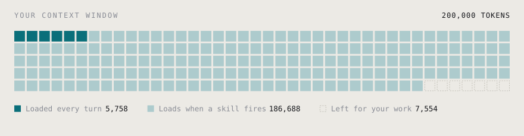

<div align="center">

# cupel

**You have never read what your agent loads.**

Grades every skill, plugin, and MCP server on your machine.
What it costs you, what it can reach, whether it works.

[](https://github.com/mihhhir08/cupel/actions/workflows/ci.yml)
[](LICENSE)
[](package.json)
[](#roadmap)

[Website](https://mihhhir08.github.io/cupel/) · [Design](docs/DESIGN.md) · [Contributing](CONTRIBUTING.md)

</div>

<br>

<picture>
  <source media="(prefers-color-scheme: dark)" srcset="assets/window-dark.svg">
  
</picture>

<br>

Every block is a thousand tokens of a 200,000 token window. Six are spent before
you type a character. One hundred and eighty seven more arrive the moment your
skills fire. Seven are left.

That is a real measurement from a real machine, taken by the command below.

## Try it

The package is not on npm yet. Until it is, run it from source:

```bash
git clone https://github.com/mihhhir08/cupel
cd cupel
npm install && npm run build
node packages/cli/dist/index.js
```

Nothing leaves your machine. No account, no API key, no network call.

## What you get

```
  Assayed 83 extensions

  A  math-olympiad          180 tok   0% of window  +4,757 on use
  A  hook-development       136 tok   0% of window  +3,909 on use
  A  command-development    128 tok   0% of window  +4,628 on use
  ...

  Token tax  5,758 tokens per turn  3% of your window
  On use     192,446 tokens if every extension fires
  Verdict    A
```

Two numbers, because they behave differently:

| | |
| --- | --- |
| **Token tax** | Names and descriptions stay resident so the agent knows what it can reach for. You pay this on **every request**. |
| **On use** | Skill bodies load only when invoked. This is what arrives if all of them fire in one session. |

## Why this exists

Coding agents went from no extension model to eight marketplaces in eighteen
months, with no verified publishers, no provenance, and no audit command.

| | |
| --- | --- |
| **36%** | of 3,984 scanned skills carry prompt-injection flaws. 76 shipped with live payloads. <sub>Snyk ToxicSkills, Feb 2026</sub> |
| **12%** | of 2,857 ClawHub skills were outright malicious. <sub>Independent audit, 2026</sub> |
| **1,184** | skills poisoned in the ClawHavoc campaign, delivered **through updates**. <sub>OWASP, Apr 2026</sub> |
| **6.2 / 12** | mean quality across 47,150 public skills. Curated sets lift agent pass rates by 16.2 points. <sub>SkillsBench, 2026</sub> |
| **$2.3B** | in direct losses attributed to prompt injection, up 340% year over year. <sub>Recorded Future, 2026</sub> |

A verified marketplace was formally requested in
[anthropics/claude-code#30727](https://github.com/anthropics/claude-code/issues/30727),
with publisher identity, security review, and code signing.

It was **closed as not planned**. Nobody is coming. Run the assay yourself.

## Three pillars, one verdict

Your verdict is your **worst** pillar, never the average. A skill that is cheap,
elegant, and unsafe does not get a B.

| Pillar | Measures | Status |
| --- | --- | --- |
| **Cost** | Token weight of every tool schema and skill body, split into per-turn and on-invocation | ✅ Shipped |
| **Safety** | Injection patterns, hidden Unicode, credential path reach, network egress, shell surface, provenance | 🔨 In progress |
| **Quality** | Structure, trigger clarity, length against usefulness, overlap with your other skills | 📋 Planned |

## Why not just a scanner

Detection catches roughly 23% of sophisticated injection attempts, and the
problem is task-conditioned. From [SkillScope, arXiv 2605.05868](https://arxiv.org/abs/2605.05868):

> Scanning tools do not reliably convert broad standing privilege into least
> privilege... the same action may be necessary under one user prompt but
> over-privileged under another.

A skill that is clean at scan time still runs with **your** privileges. Your SSH
keys, your cloud credentials, your production access.

Runtime enforcement is the real answer and it is on the roadmap. But a tool
nobody installed cannot enforce anything, so cupel starts by showing you what
you already have.

## Roadmap

| | |
| --- | --- |
| ✅ | Discovery across Claude Code skills, plugins, and MCP config |
| ✅ | Cost pillar, per-turn and deferred accounting |
| 🔨 | Safety pillar and the YAML rule engine |
| 📋 | Quality pillar, overlap and trigger-clarity detection |
| 📋 | `cupel lock` and `cupel diff`, so rug pulls are caught locally |
| 📋 | `cupel gate` for CI, HTML report, Python SDK |

## Contributing

**Detection rules are YAML, not TypeScript.** You can add one without reading a
line of the engine. That is deliberate: no single maintainer can keep pace with
this ecosystem.

See [CONTRIBUTING.md](CONTRIBUTING.md) for how to write and test a rule.

## Principles

- **No network.** Zero calls in the default path, enforced by a test rather than a promise.
- **No account, no telemetry.** Credential values in your config are never read, stored, or rendered.
- **Cross-platform.** Existing runtime tools are Linux kernel only. This runs on your Mac.
- **Rules are data.** Versioned YAML with their own test cases.

## Documentation

| | |
| --- | --- |
| [DESIGN.md](docs/DESIGN.md) | Problem analysis, architecture, module boundaries |
| [PRD.md](docs/PRD.md) | Requirements, users, success metrics, risks |
| [SCOPE.md](docs/SCOPE.md) | Phases, out-of-scope register, definition of done |
| [SECURITY.md](SECURITY.md) | Threat model and disclosure |

## License

[Apache-2.0](LICENSE)
